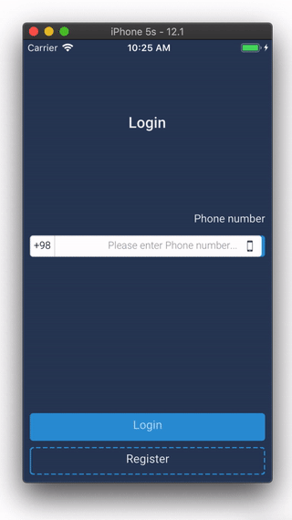

# FLMC-Design

Form List Model Controller

# Form Demo

the goal is to convert below code to this ->

<a href="./resources/form-demo.gif">

</a>

```swift

class LoginForm: Form {

  // Callbacks
  var onLogin: CallBack = {}
  var onRegister: CallBack = {}
  var onSendValidationCode: CallBack = {}
  var onEditPhoneNumber: CallBack = {}
  var onResendValidationCode: CallBack = {}
  var actionShowError: CallBack = {}

  // Data Controllers
  var phoneNumber = BehaviorRelay<String?>(value: "")
  var validationCode = BehaviorRelay<String?>(value: "")
  var resendValidationTimerValue = BehaviorRelay<Int>(value: 0)

  var formState = BehaviorRelay<LoginStates>(value: .phoneNumberInput)

  // Custom Validation
  override func validations() -> [ValidationResultModel] {
    // validate re send validation code timer
    return [
      ValidationResultModel(
          description: "Please wait a few seconds",
          isValid: formState.value == .validationInput ? true : resendValidationTimerValue.value == 0)
    ]
  }


  override func elements() -> [Element] {
    // resend validation code timer
    Observable<Int>
        .timer(0, period: 1, scheduler: SerialDispatchQueueScheduler(qos: .default))
        .observeOn(MainScheduler.instance).subscribe(onNext: { _ in
          self.resendValidationTimerValue.acceptIfChanged(max(0, self.resendValidationTimerValue.value - 1))
        }).disposed(by: disposeBag)
    
    return [
      // header
      Pad(),
      Text("Login").style(.heading(.center)),
      Pad(),
      // inputs
      Input(phoneNumber)
          .tile("Phone Number")
          .validations([.phoneNumber, .notNullOrEmpty])
          .tap { if self.formState.value == .validationInput { self.onEditPhoneNumber() } }
      Input(validationCode)
          .title("Validation Code")
          .valitations([.numbers, .maxLength(5)])
          .visibility(formState.map { $0 == .validationInput }),
      Text(resendValidationTimerValue.map { $0 > 0 ? "\($0.str) seconds" : "Resend Validation Code" })
          .visibility(formState.map { $0 == .validationInput })
          .tap { if self.resendValidationTimerValue.value == 0 { self.onResendValidationCode() } },
      // submits
      Pad(2),
      ValidationMessage(),
      Button()
          .tap { self.formState.value == .phoneNumberInput ? self.onLogin() : self.onSendValidationCode() }
          .text(formState.map { $0 == .phoneNumberInput ? "Login" : "Validate" })
          .isSubmit(),
      Space(0),
      Button().style(.more)
          .visibility(formState.map { $0 == .phoneNumberInput })
          .tap { self.onRegister() }
          .text("Register"),
      Space(0),
      //endregion
    ]
  }
}

```

> this code is a prototype implemented in swift
